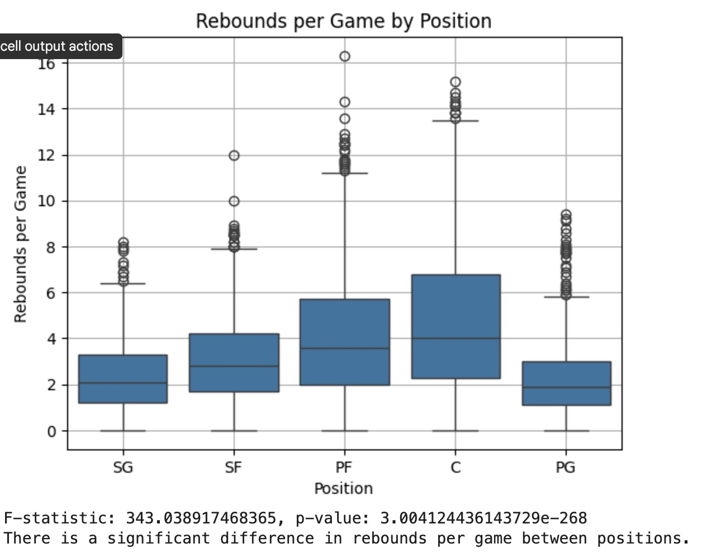
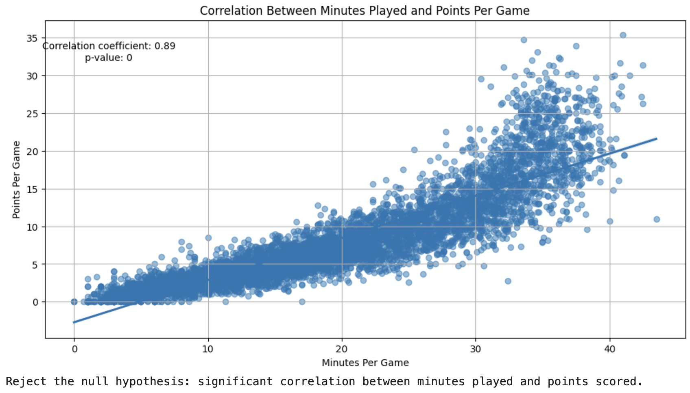
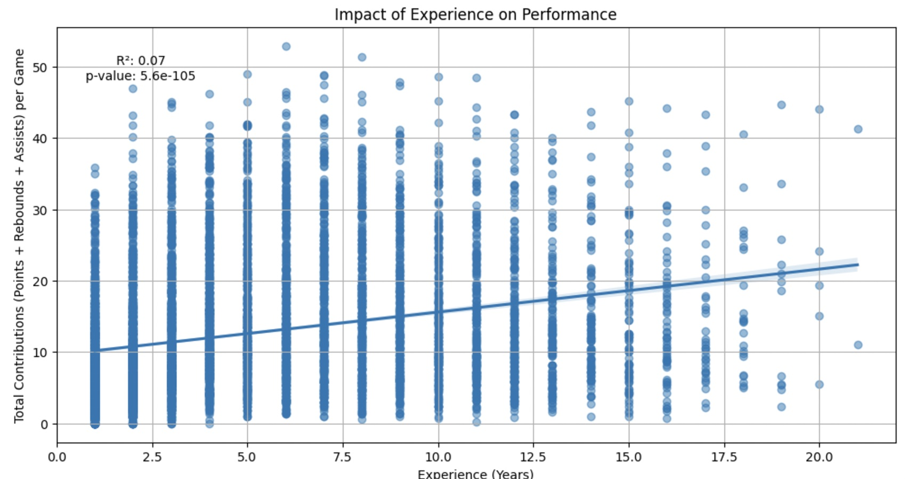
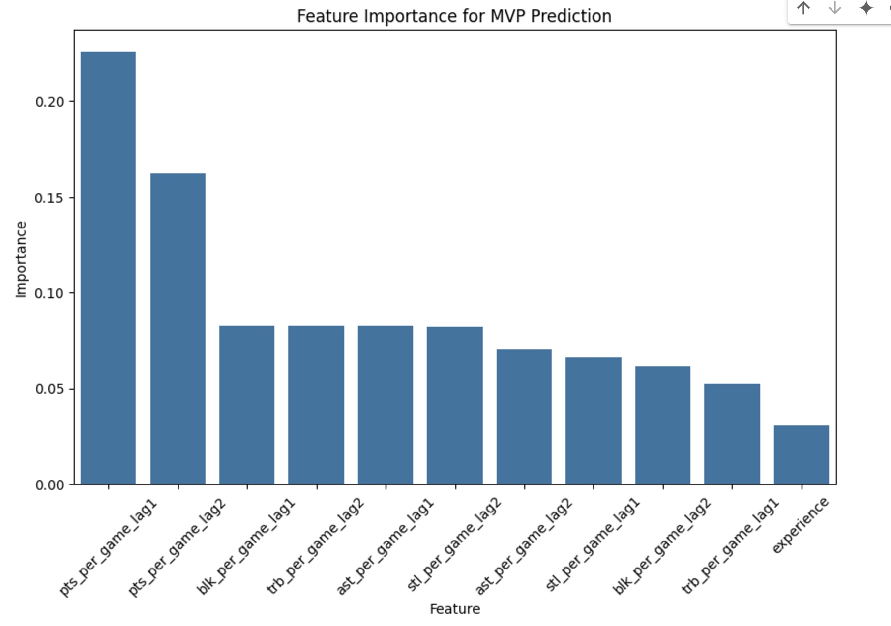
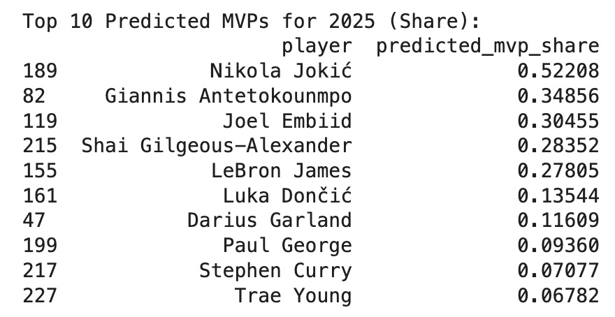
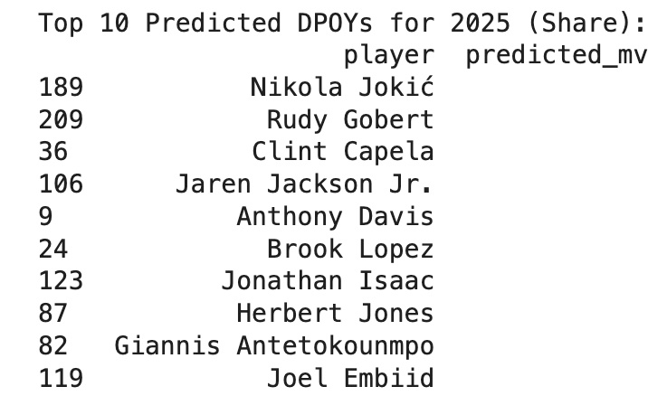
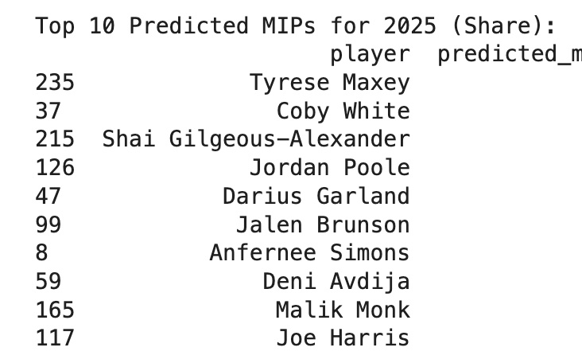

# Uncovering Trends and Patterns in NBA Player Statistics
### Fall 2024 Data Science Project
### Paul Kettlestrings
I worked on this project by myself, and thus was the sole contributer for every part of the project.

## Introduction
For this project, I chose to look at NBA statistics. I love watching basketball, and I wanted to see if some assumptions I had about the game would be backed up by the data. I looked at the effect of position and experience on player performance, as well as how a player's minutes impacts their points per game. I also wanted to use the data to make some predictions about the upcoming season, such as who will win the MVP award and the Most Improved Player award.

## Data Curation
The dataset I am using for this project is [NBA Stats (1947-present)](https://www.kaggle.com/datasets/sumitrodatta/nba-aba-baa-stats/data), found on kaggle.com. The dataset includes numerous csv files with player stats, team stats, award winners, and more, going all the way back to the founding of the NBA. We will be using the PlayerPerGame.csv and PlayerAwardShares.csv files. PlayerPerGame.csv includes per game stats for every player to have played in the NBA, with a unique entry for every season. PlayerAwardShares contains the results of voting for numerous end-of-season awards, such as MVP, Defensive Player of the Year, and more.   

The first thing we need to do is import the libraries we'll be using throughout the project:
```python
import numpy as np
import pandas as pd
import matplotlib.pyplot as plt
import seaborn as sns
from scipy.stats import f_oneway, pearsonr
import statsmodels.api as sm
```
Next, we have to use pandas to convert the two csv files into dataframes.
```python
player_per_game = pd.read_csv('Player_per_game.csv')
player_award_shares = pd.read_csv('Player_award_shares.csv')
```
To prepare these files for analysis, there are a few things we have to do. Firstly, although the data goes back to 1947, I want to only look at data from the year 2000 to the present, since the NBA has changed a lot over the years and statistics from long ago won't have as much relevance when trying to predict things in the future.
```python
player_per_game = player_per_game[player_per_game['season'] >= 2000]
player_award_shares = player_award_shares[player_award_shares['season'] >= 2000]
```
Now we'll start working on the player_per_game dataframe. The first thing we'll do is remove some of the columns, since they are irrelevant for our purposes.
```python
player_per_game = player_per_game.drop(columns=['birth_year', 'lg'])
```
Some players are present in the dataset multiple times for the same season due to being traded mid-season. In these cases, there is an entry for the player's performance on each team and an additional entry for their total stats for the whole season. We only care about their total stats, so we'll remove the entries for the individual teams.
```python
multi_team_players = player_per_game[player_per_game.duplicated(subset=['player', 'season'], keep=False)]['player'].unique()
player_per_game = player_per_game[(player_per_game['tm'] == 'TOT') | (~player_per_game['player'].isin(multi_team_players))]
player_per_game = player_per_game.reset_index(drop=True)
```
Some players play multiple positions over the course of the season. In these cases, they have multiple positions listed in the pos column (C-PF for example). To make things easier, we only care about the player's primary position, so we'll remove the secondary position in such cases.
```python
player_per_game['pos'] = player_per_game['pos'].str.split('-').str[0]
```
Finally, we're going to create a new column called total_contributions_per_game, which is the sum of a player's points, rebounds, and assists per game. This is to have a more complete measure of a player's all-around performance, which we will use later on.
```python
player_per_game['total_contributions_per_game'] = (player_per_game['pts_per_game'] + player_per_game['trb_per_game'] + player_per_game['ast_per_game'])
```
Now, we'll move on to the player_award_shares dataframe. This one is a bit more complicated to work with. If a player is nominated for multiple awards in the same season, such as MVP and DPOY, those two nominations are given separate entries. In order to be able to eventually merge this with the player_per_game dataframe, we want to have only one entry per player per season, so we'll have to combine them somehow.   
First, we'll create a list containing all of the awards we have data for and create columns for each of the awards.
```python
awards = ['clutch_poy', 'dpoy', 'mip', 'nba mvp', 'nba roy', 'smoy']
award_columns = []
for award in awards:
  award_columns.append(f'{award.lower().replace(" ", "_")}_first')
  award_columns.append(f'{award.lower().replace(" ", "_")}_pts_won')
  award_columns.append(f'{award.lower().replace(" ", "_")}_share')
  award_columns.append(f'{award.lower().replace(" ", "_")}_winner')
```
Next, pivot the table to add the award columns, filling in any empty spots with the appropriate value:
```python
award_pivot = player_award_shares.pivot_table(
    index=['player_id', 'seas_id', 'season', 'player', 'age', 'tm'],
    columns='award',
    values=['first', 'pts_won', 'share', 'winner'],
    aggfunc={'first' : 'sum', 'pts_won' : 'sum', 'share' : 'sum', 'winner' : 'any'}, 
    fill_value=0
)

award_pivot.columns = [f'{col[1].lower().replace(" ", "_")}_{col[0]}' for col in award_pivot.columns]
award_pivot = award_pivot.reset_index()

for award in awards:
    winner_col = f'{award.lower().replace(" ", "_")}_winner'
    award_pivot[winner_col] = award_pivot[winner_col].astype(bool)
```
Finally, we can merge the player_per_game and player_award_shares dataframes together into a single dataframe that will contain all the information we need. We'll fill in the award data for players who weren't nominated for awards with the appropriate values.
```python
final_merged_data = pd.merge(player_per_game, award_pivot, on=['player_id', 'seas_id'], how='left')

award_share_columns = [f'{award.lower().replace(" ", "_")}_pts_won' for award in awards] + \
                      [f'{award.lower().replace(" ", "_")}_share' for award in awards]
final_merged_data[award_share_columns] = final_merged_data[award_share_columns].fillna(0)

winner_columns = [f'{award.lower().replace(" ", "_")}_winner' for award in awards]
final_merged_data[winner_columns] = final_merged_data[winner_columns].fillna(False)
```

Our dataframe is ready for work, and we can now move on to the next step.

## Exploratory Data Analysis
Now that we have our dataframe ready to go, we can perform some basic analysis to get a sense for the data. To do this, I decided to test some hypotheses I had about certain factors that could impact a player's performance.
### Does a player's position impact their rebounding numbers?
Intuition would tell you that centers and power forwards, who are generally the tallest players on the court, would get more rebounds per game than players in other positions. Let's see if that's really true!   
We'll use an ANOVA test for this since we have multiple categories that we will be comparing to see if there is any significant difference between them.   
We can use seaborn to make a box plot with position on the x-axis and rebounds per game on the y-axis.
```python
plt.figure()
sns.boxplot(data=final_merged_data, x='pos', y='trb_per_game')
plt.title("Rebounds per Game by Position")
plt.xlabel("Position")
plt.ylabel("Rebounds per Game")
plt.grid(True)
plt.show()

grouped_data = [group['trb_per_game'].values for name, group in final_merged_data.groupby('pos')]

f_stat, p_value = f_oneway(*grouped_data)

print(f"F-statistic: {f_stat}, p-value: {p_value}")
alpha = 0.05
if p_value < alpha:
    print("There is a significant difference in rebounds per game between positions.")
else:
    print("There is no significant difference in rebounds per game between positions.")
```
This results in the following plot:   

<br>
As we can see, centers and power forwards have the highest average rebounds per game, and the ANOVA test determined that there is a significant difference in rebounds per game between positions.

### Does playing more minutes lead to scoring more points?
Common sense would suggest that players who play more would score more points, both since they have more opportunities and because they are generally better than those who only play a small amount. Let's check to be sure, though.   
We'll use a Pearson correlation test here, since we are measuring the correlation between two variables, minutes per game and points per game, and we would expect them to be linearly correlated. We'll create a scatter plot with every season and plot the line of best fit to see if it is linear.
```python
corr, p_value = pearsonr(final_merged_data['mp_per_game'], final_merged_data['pts_per_game'])

plt.figure(figsize=(12, 6))
sns.regplot(x='mp_per_game', y='pts_per_game', data=final_merged_data, scatter_kws={'alpha':0.5})
plt.title('Correlation Between Minutes Played and Points Per Game')
plt.xlabel('Minutes Per Game')
plt.ylabel('Points Per Game')
plt.grid(True)
plt.text(0.1, 0.9, f'Correlation coefficient: {corr:.2f}\np-value: {p_value:.2g}',
         horizontalalignment='center', verticalalignment='center', transform=plt.gca().transAxes)
plt.show()

alpha = 0.05
if p_value < alpha:
    print("Reject the null hypothesis: significant correlation between minutes played and points scored.")
else:
    print("Fail to reject the null hypothesis: no significant correlation.")
```

<br>
As we can see, there is a clear linear correlation between minutes per game and points per game, as we would expect. 

### Does more experience in the NBA lead to increased performance?
Generally, players who last in the NBA for many years are the most talented players who are able to sustain a high level of play even as they age. Therefore, it would make sense that the longer you've been in the league, the better your performance would be. To determine if this is the case, we'll use the total_contributions_per_game stat we created earlier.   
For this, we'll use a linear regression analysis to determine how the trend of the data looks.
```python
X = final_merged_data['experience']
y = final_merged_data['total_contributions_per_game']
X = sm.add_constant(X)

model = sm.OLS(y, X).fit()

plt.figure(figsize=(12, 6))
sns.regplot(x='experience', y='total_contributions_per_game', data=final_merged_data, scatter_kws={'alpha':0.5})
plt.title('Impact of Experience on Performance')
plt.xlabel('Experience (Years)')
plt.ylabel('Total Contributions (Points + Rebounds + Assists) per Game')
plt.grid(True)
plt.text(0.1, 0.9, f'R²: {model.rsquared:.2f}\np-value: {model.pvalues[1]:.2g}',
         horizontalalignment='center', verticalalignment='center', transform=plt.gca().transAxes)
plt.show()

print(model.summary())
```

<br>
As shown in the plot, experience is positively correlated with higher production. Therefore, we can safely say that players with more experience in the NBA perform better than less experienced players.

## Primary Analysis
Now we're going to use machine learning to make some predictions about the upcoming NBA season. We'll predict the winners of the MVP, DPOY, and Most Improved Player awards by looking at the performance of past winners.   
First, let's sort our dataframe by player name and season.
```python
final_merged_data = final_merged_data.sort_values(by=['player_x', 'season_x'])
```
Since we're making predictions without any statistics for the current season, only past years, we're going to look at the previous two seasons for each award winner. For example, if Stephen Curry won the MVP award in 2015, we'll look at his 2013 and 2014 statistics as a predictive measure. We can then compare those to the stats of current players for the 2023 and 2024 seasons to see who may be on track for a MVP season.   
First, we need to create lag features to capture the players' performance over their previous two seasons.
```python
for lag in [1, 2]:
    for stat in ['pts_per_game', 'ast_per_game', 'trb_per_game', 'stl_per_game', 'blk_per_game']:
        final_merged_data[f'{stat}_lag{lag}'] = final_merged_data.groupby('player_x')[stat].shift(lag)
```
Now, we'll drop entries with NaNs in the lag columns. Unfortunately this will exclude players who were rookies last year, but it is extremely rare for a player to win MVP in their second year, and it is important to have more than one season of data to avoid outliers.
```python
final_merged_data = final_merged_data.dropna(subset=['pts_per_game_lag1', 'pts_per_game_lag2'])
```
Next, we create binary labels for each award based on whether the player won that season.
```python
final_merged_data['mvp_share'] = final_merged_data['nba_mvp_share'].fillna(0)
final_merged_data['dpoy_share'] = final_merged_data['dpoy_share'].fillna(0)
final_merged_data['mip_share'] = final_merged_data['mip_share'].fillna(0)
```
Now we'll make a list of the features we'll use to predict the award winners, which includes the lag features we created earlier as well as the player's experience in the league.
```python
features = [
    'pts_per_game_lag1', 'ast_per_game_lag1', 'trb_per_game_lag1', 'stl_per_game_lag1', 'blk_per_game_lag1',
    'pts_per_game_lag2', 'ast_per_game_lag2', 'trb_per_game_lag2', 'stl_per_game_lag2', 'blk_per_game_lag2', 'experience'
]

X = final_merged_data[features]
y_mvp = final_merged_data['mvp_share']
y_dpoy = final_merged_data['dpoy_share']
y_mip = final_merged_data['mip_share']
```
Next, we'll split the data into training and testing groups using train_test_split, with 80% being used for training and 20% for testing. 
```python
X_train, X_test, y_train_mvp, y_test_mvp = train_test_split(X, y_mvp, test_size=0.2, random_state=42)
X_train, X_test, y_train_dpoy, y_test_dpoy = train_test_split(X, y_dpoy, test_size=0.2, random_state=42)
X_train, X_test, y_train_mip, y_test_mip = train_test_split(X, y_mip, test_size=0.2, random_state=42)
```
Next, we'll initialize random forest regressors for each award category. We are using regression instead of classification since there are so few players who have actually won an award (only one per season), that it was difficult for the model to learn. By using the share of votes instead, it includes all players who received votes for an award, greatly increasing the sample size. Therefore, we must use regression, since we are predicting the vote share based on their previous seasons.
```python
rf_mvp = RandomForestRegressor(n_estimators=100, random_state=42)
rf_dpoy = RandomForestRegressor(n_estimators=100, random_state=42)
rf_mip = RandomForestRegressor(n_estimators=100, random_state=42)
```
Now we can fit the models and use them to make predictions on the test data.
```python
rf_mvp.fit(X_train, y_train_mvp)
rf_dpoy.fit(X_train, y_train_dpoy)
rf_mip.fit(X_train, y_train_mip)

y_pred_mvp = rf_mvp.predict(X_test)
y_pred_dpoy = rf_dpoy.predict(X_test)
y_pred_mip = rf_mip.predict(X_test)
```
Next, we'll create a function that determines which of our features have the highest importance for predicting the MVP winner, or the strongest correlation with the expected results. Again, we'll look at the results later.
```python
def plot_feature_importance(rf_model, features, title):
    feature_importances = rf_model.feature_importances_
    features_sorted = sorted(zip(features, feature_importances), key=lambda x: x[1], reverse=True)
    
    plt.figure(figsize=(10, 6))
    sns.barplot(x=[x[0] for x in features_sorted], y=[x[1] for x in features_sorted])
    plt.title(title)
    plt.xlabel("Feature")
    plt.ylabel("Importance")
    plt.xticks(rotation=45)
    plt.show()

plot_feature_importance(rf_mvp, features, "Feature Importance for MVP Prediction")
```
Now it's time to use our model to make our predictions for the upcoming season. First, we need to aggregate the player stats from 2023 and 2024 to create a new dataset to test the model on.
```python
recent_season_data = final_merged_data[final_merged_data['season_x'].isin([2023, 2024])]
test_data_aggregated = recent_season_data.groupby('player_x').agg({
    'pts_per_game_lag1': 'mean',
    'ast_per_game_lag1': 'mean',
    'trb_per_game_lag1': 'mean',
    'stl_per_game_lag1': 'mean',
    'blk_per_game_lag1': 'mean',
    'pts_per_game_lag2': 'mean',
    'ast_per_game_lag2': 'mean',
    'trb_per_game_lag2': 'mean',
    'stl_per_game_lag2': 'mean',
    'blk_per_game_lag2': 'mean',
    'nba_mvp_share': 'mean',
    'dpoy_share': 'mean',
    'mip_share': 'mean',
    'experience': 'mean'
}).reset_index()
```
Next, we'll define our features and labels again for the new dataset and then make our predictions! We'll store our results in a new dataframe called predictions_2025 so we can access them.
```python
X_test_aggregated = test_data_aggregated[features]
y_test_mvp = test_data_aggregated['nba_mvp_share']
y_test_dpoy = test_data_aggregated['dpoy_share']
y_test_mip = test_data_aggregated['mip_share']

y_pred_mvp_2025 = rf_mvp.predict(X_test_aggregated)
y_pred_dpoy_2025 = rf_dpoy.predict(X_test_aggregated)
y_pred_mip_2025 = rf_mip.predict(X_test_aggregated)

predictions_2025 = pd.DataFrame({
    'player': test_data_aggregated['player_x'],
    'predicted_mvp_share': y_pred_mvp_2025,
    'predicted_dpoy_share': y_pred_dpoy_2025,
    'predicted_mip_share': y_pred_mip_2025
})
```
Finally, we'll rank the players based on their expected award share for each award and display the top 10 most likely winners.
```python
predictions_2025_mvp = predictions_2025.sort_values(by='predicted_mvp_share', ascending=False)
predictions_2025_dpoy = predictions_2025.sort_values(by='predicted_dpoy_share', ascending=False)
predictions_2025_mip = predictions_2025.sort_values(by='predicted_mip_share', ascending=False)

print("Top 10 Predicted MVPs for 2025 (Share):")
print(predictions_2025_mvp.head(10))

print("\nTop 10 Predicted DPOYs for 2025 (Share):")
print(predictions_2025_dpoy.head(10))

print("\nTop 10 Predicted MIPs for 2025 (Share):")
print(predictions_2025_mip.head(10))
```
We're finally done! Time to take a look at our results.

## Visualization
First, let's look at which factors have the largest influence on our predictions. 
   
<br>
As we can see, the player's points per game in the previous season has the highest predictive power when it comes to predicting the MVP for the next season. This makes sense, as points are the most important stat in basketball, and scoring a lot of points last season is a strong indicator that a player will score a lot of points this season. In fact, the second most important metric is the points per game two seasons ago, which underscores how important scoring is in the MVP race. All of the other features are roughly equal, although notably experience is the least predictive feature. This is somewhat surprising, as I thought that experienced players are generally better and among the top contenders for the MVP award.   
   
Now, let's look at who the model predicted to win the three awards, starting with MVP.

   
<br>
Nikola Jokic was the model's pick for next season's MVP. As a 3-time winner of the award (including last year), he's definitely a good bet to win this year, and in fact, as of December 2024, he's the betting favorite in Vegas. Other predicted contenders include Giannis, Embiid, and SGA, of whom Giannis and SGA are in the top 4 in terms of betting odds.   

   
<br>
The model also predicts Jokic to win the Defensive Player of the Year award. This is a slightly more questionable pick, as Jokic isn't really known for being an exceptional defender. However, the rest of the list is much more in line with expectations. Rudy Gobert is a four-time DPOY winner, and Jaren Jackson Jr. is the second favorite for the award in terms of odds (The favorite, Victor Wembanyama, was not included in our analysis since last year was his rookie season). This award seems like it would be harder to predict than the MVP award, though, since defense in basketball is largely "intangibles" and is harder to measure in hard numbers.   

   
<br>
Finally, for Most Improved Player, the model goes for Tyrese Maxey, with Coby White coming in second. Remarkably, these were the top two players in voting for the award last year, with Maxey winning and White coming in second. So although they probably won't win this year, the model was only one year off. Some of the players on this list are already established stars, and thus won't win the award (SGA, Brunson, and Garland), but the others are all young players with a lot of upside who, with a good year, could have a chance to win. In particular, Anfernee Simons and Deni Avdija both currently have good odds to win the award this year.   

## Insights and Conclusions

After reading this tutorial, you should understand how to use data science techniques such as statistical tests machine learning to find patterns in and make predictions from large data sets. We used numerous python libraries such as pandas, seaborn, and scikit-learn, all of which fulfilled different roles in the project. Our model turned out to be relatively successful, and although it had a few questionable predictions, for the most part it had very reasonable results. To make the model more accurate, it would help to include statistics on team performance, as that often has a role in MVP voting, since it's important for a MVP-caliber player to lead his team to success. Overall, though, this project was a success, and it produced some strong contenders for this year's awards.
